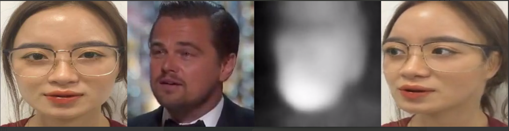

## ENHANCED DATA DAGAN (TCOM)


### Results
<p align="center">
  
</p>


### Installation
1. Download pretrain model
+ Download checkpoint and put into folder checkpoint
https://drive.google.com/file/d/1wvddv6PinTpIIXP0xo7_7flTW2qHF-7S/view?usp=sharing
+ Download file config and put into folder config
https://drive.google.com/drive/folders/1frHJAJG9JUYj3VjPRuBSXullcOl2vO2t?usp=sharing
+ Folder video contain video
+ Folder image contain image
2. Install packages

    ```bash
   cd DaGan
    pip install -r requirements.txt
    ## Install the Face Alignment library
    cd face-alignment
    python setup.py install
    ```


3, Run demo
```bash
python demo.py  --config config/vox-adv-256.yaml --driving_video video/name_video --source_image image/name_image --checkpoint checkpoint/name_checkpoint --relative --adapt_scale --kp_num 15 --generator DepthAwareGenerator 
```
The result will be stored in ```result.mp4```.


